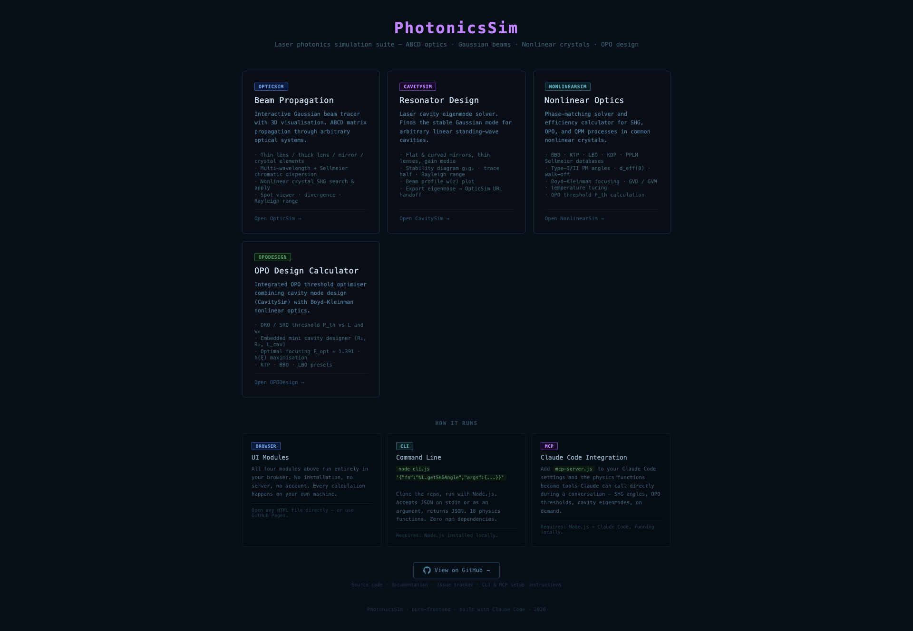
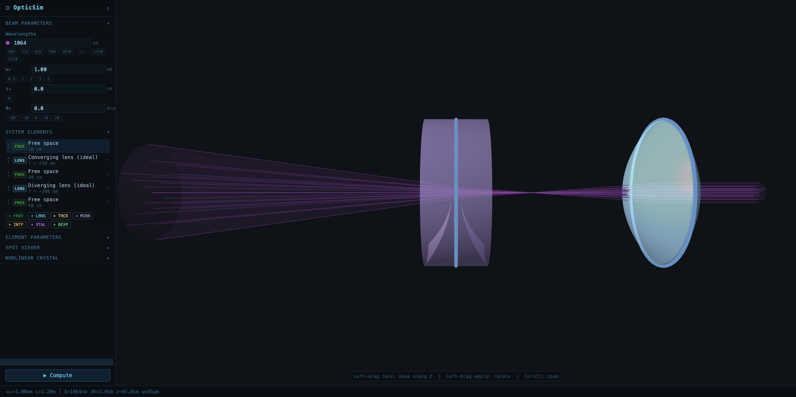
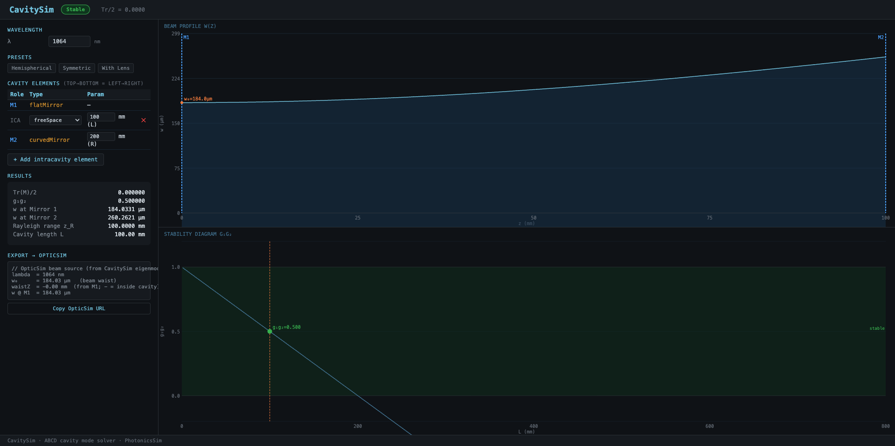
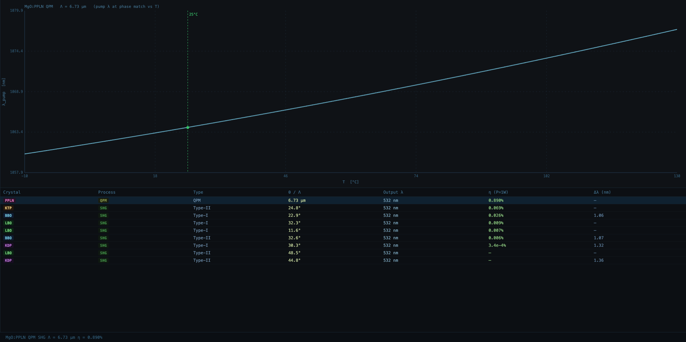
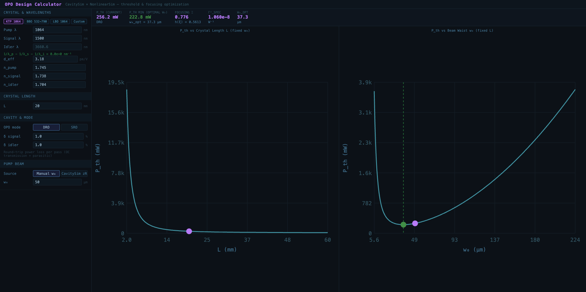

# PhotonicsSim

**A browser-based laser photonics simulation suite for Gaussian beam propagation, nonlinear crystal phase-matching, cavity eigenmode analysis, and OPO design.**

No installation. No build step. Open the HTML files directly in a browser.

---

## How This Was Built

PhotonicsSim was developed entirely through conversational sessions with **[Claude Code](https://claude.ai/code)** (Anthropic's AI coding assistant), by a researcher who works with lasers and photonics but is not a professional software developer.

I am not familiar with optics. Someone needed a tool like this, so I tried to build it with Claude's help — Claude provided the physics, the formulas, the references, and all the code. I mostly asked questions, described what was needed, and checked the outputs against a few reference cases I could find online.

**If you plan to use the results for real work, please verify them yourself.** The physics is referenced to published literature (Kato 1986/1994, Boyd & Kleinman 1968, Armstrong et al. 1962, Gayer 2008), and a few spot-checks pass (see [Physics Validation](#physics-validation)), but I cannot independently verify the underlying equations. If something looks wrong, it may well be — please open an issue.

Development was done in June 2026, across multiple Claude Code sessions. The entire codebase — ~3000 lines of physics JS, ~2000 lines of UI — was written by Claude from scratch.

---

## What's Inside

```
PhotonicsSim/
├── index.html              ← Hub page (start here)
├── OpticSim/               ← Gaussian beam propagation + 3D visualiser
├── CavitySim/              ← Laser cavity eigenmode solver
├── NonlinearSim/           ← Nonlinear crystal phase-matching engine
├── OPODesign/              ← Integrated OPO threshold calculator
├── cli.js                  ← Node.js CLI for LLM/script access
└── mcp-server.js           ← MCP server for Claude Code integration
```

### Modules

| Module | What it does |
|--------|-------------|
| **OpticSim** | Interactive Gaussian beam tracer. ABCD matrix propagation through lenses, mirrors, crystals. 3D visualisation with Three.js. Multi-wavelength with Sellmeier chromatic dispersion. |
| **NonlinearSim** | Phase-matching solver for SHG and OPO. Crystals: BBO, KTP, LBO, KDP, MgO:PPLN. Returns PM angle, d_eff, walk-off, acceptance bandwidth, conversion efficiency. |
| **CavitySim** | Standing-wave cavity eigenmode solver. Returns complex q-parameter, beam radii, Rayleigh range, w(z) profile. Exports eigenmode to OpticSim via URL handoff. |
| **OPODesign** | Combined OPO threshold calculator. Embeds a mini cavity designer to compute the beam waist at the crystal from the cavity geometry, then feeds it into Boyd-Kleinman threshold theory. |

---

## Quick Start

1. Clone or download this repository
2. Open `index.html` in a browser (Chrome recommended)
3. Click a module card to open it

Or open any module directly:
- `OpticSim/04-integration/index.html`
- `CavitySim/04-ui/index.html`
- `NonlinearSim/04-ui/index.html`
- `OPODesign/index.html`

No server needed. All computation runs in the browser.

---

## Screenshots


*Hub page — module overview and access modes*


*OpticSim — Gaussian beam propagation through a two-lens system, 3D visualisation*


*CavitySim — hemispherical cavity eigenmode: beam profile w(z) and g₁g₂ stability diagram*


*NonlinearSim — 1064→532nm SHG crystal comparison (all PM types) and PPLN temperature tuning curve*


*OPODesign — KTP OPO threshold P_th vs crystal length L (left) and beam waist w₀ (right), with optimal focusing marked*

---

## LLM / Programmatic Access

The physics engine is also available as a CLI and an MCP server — designed for use with AI assistants that can call tools.

### CLI

```bash
node cli.js '{"fn":"NL.getSHGAngle","args":{"crystal":"bbo","pump_nm":1064,"type":"I"}}'
echo '{"fn":"CAVITY.solve","args":{...}}' | node cli.js
node cli.js list    # print all available functions
```

**18 functions available** across NL (nonlinear optics), CAVITY (cavity solver), and BK (Boyd-Kleinman) namespaces. Zero npm dependencies.

### MCP Server (Claude Code integration)

Add to your `~/.claude/settings.json`:

```json
"mcpServers": {
  "photonics": {
    "command": "node",
    "args": ["/path/to/PhotonicsSim/mcp-server.js"]
  }
}
```

Then in a Claude Code session, the tools `nl_shg_angle`, `nl_opo_threshold`, `cavity_solve`, etc. become directly callable. This is the intended long-term use case: an AI assistant that can run photonics calculations on demand.

**9 MCP tools:** `nl_shg_angle` · `nl_shg_ppln` · `nl_find_combinations` · `nl_opo_threshold` · `nl_opo_optimal` · `nl_opo_tuning` · `cavity_solve` · `cavity_scan` · `crystal_index`

---

## Physics Validation

Every physics module has a self-contained HTML validation page. Open any of them directly in a browser — they load the same physics JS files the tools use, run the test suite, and print PASS/FAIL with the computed numbers alongside the expected values. No server needed.

The intent is to make it easy for anyone with domain knowledge to check the numbers. If a result looks wrong to you, you can open the relevant page, read the exact inputs and outputs, and compare against your own reference.

### Validation pages

| Module | Validation page | Tests | What it checks |
|--------|-----------------|-------|----------------|
| CavitySim — ABCD elements | [`CavitySim/01-elements/elements-results.html`](CavitySim/01-elements/elements-results.html) | 30 | Matrix entries, determinant = 1, CurvedMirror = ThinLens(R/2) |
| CavitySim — round-trip matrix | [`CavitySim/02-physics/roundtrip-results.html`](CavitySim/02-physics/roundtrip-results.html) | 30 | g₁g₂ for hemispherical/concentric/confocal/planar/unstable cavities |
| CavitySim — eigenmode | [`CavitySim/02-physics/eigenmode-results.html`](CavitySim/02-physics/eigenmode-results.html) | 27 | Analytic eigenmode of hemispherical cavity; wavefront curvature = mirror radius |
| CavitySim — stability scan | [`CavitySim/02-physics/stability-results.html`](CavitySim/02-physics/stability-results.html) | 29 | g₁g₂ limits at L=0, L=R (confocal), L=2R (concentric); w → ∞ at concentric |
| CavitySim — solver API | [`CavitySim/03-solver/solver-results.html`](CavitySim/03-solver/solver-results.html) | 32 | CAVITY.solve() / scanLength() / findMinWaistLength() end-to-end |
| NonlinearSim — Sellmeier | [`NonlinearSim/01-crystals/index.html`](NonlinearSim/01-crystals/index.html) | 23 | n(λ) at tabulated wavelengths vs. primary Sellmeier paper values (±0.002) |
| NonlinearSim — ne(θ), Δk | [`NonlinearSim/02-physics/index.html`](NonlinearSim/02-physics/index.html) | 13 | At PM angle: ne(2ω, θ_PM) = no(ω) exactly; Δk = 0 |
| NonlinearSim — SHG PM angles | [`NonlinearSim/02-physics/shg-results.html`](NonlinearSim/02-physics/shg-results.html) | 14 | BBO 22.8°, LBO 11.6°, KDP 30.3° vs. Kato/Nikogosyan literature |
| NonlinearSim — OPO tuning | [`NonlinearSim/02-physics/opo-results.html`](NonlinearSim/02-physics/opo-results.html) | 14 | Energy conservation at every tuning point; degenerate point at 2λ_pump |
| NonlinearSim — PPLN QPM | [`NonlinearSim/02-physics/ppln-results.html`](NonlinearSim/02-physics/ppln-results.html) | 9 | Λ = 6.73 µm for 1064→532nm; temperature tuning rate ~0.12 nm/°C |
| NonlinearSim — SHG efficiency | [`NonlinearSim/02-physics/efficiency-results.html`](NonlinearSim/02-physics/efficiency-results.html) | 16 | KTP cross-check vs. Arizona OPTI511L lab values; PPLN/BBO efficiency ratio |
| NonlinearSim — NL solver API | [`NonlinearSim/03-solver/solver-results.html`](NonlinearSim/03-solver/solver-results.html) | 79 | All NL.* functions; biaxial regression (64→79 after KTP/LBO added) |
| NonlinearSim — biaxial PM | [`NonlinearSim/02-physics/biaxial-results.html`](NonlinearSim/02-physics/biaxial-results.html) | 19 | KTP φ=24.78° (Kato 1994), LBO φ=11.61° (< 0.3° from literature) |
| NonlinearSim — depleted pump | [`NonlinearSim/02-physics/efficiency-depleted-results.html`](NonlinearSim/02-physics/efficiency-depleted-results.html) | 17 | tanh²(γ) < 1 always; matches linear formula at low power; no saturation artefacts |
| NonlinearSim — Boyd-Kleinman | [`NonlinearSim/02-physics/bk-focus-results.html`](NonlinearSim/02-physics/bk-focus-results.html) | 16 | ξ_opt = 1.391, h_max = 0.645; loose-focus limit h(ξ) → ξ |
| NonlinearSim — d_eff tensor | [`NonlinearSim/02-physics/deff-results.html`](NonlinearSim/02-physics/deff-results.html) | 22 | BBO/KTP/LBO/KDP/PPLN vs. Dmitriev 1999; boundary conditions d_eff(0°), d_eff(90°) |
| NonlinearSim — GVD / GVM | [`NonlinearSim/02-physics/gvd-results.html`](NonlinearSim/02-physics/gvd-results.html) | 26 | BBO β₂ monotonicity; analytic polynomial test (< 0.01%); KTP GVM₁₂ = 307.8 fs/mm |
| NonlinearSim — temperature n(λ,T) | [`NonlinearSim/02-physics/thermal-results.html`](NonlinearSim/02-physics/thermal-results.html) | 28 | LBO noncritical PM temperature T_noncrit ≈ 149°C (experimentally established) |
| NonlinearSim — OPO threshold | [`NonlinearSim/02-physics/opo-threshold-results.html`](NonlinearSim/02-physics/opo-threshold-results.html) | 25 | KTP DRO P_th ≈ 248 mW; minimum at ξ_opt = 1.391 (consistent with BK result) |
| Public reference (vendor data) | [`NonlinearSim/validation.html`](NonlinearSim/validation.html) | — | PM angles and efficiency vs. EKSMA/Castech/United Crystals datasheets |

**Total: ~490 automated test assertions** across 19 validation pages.

### A note on the KTP 1.3° discrepancy

The computed KTP Type-II PM angle is φ=24.78° (Kato 1994 Sellmeier), while vendor datasheets typically quote ~23.5° (Bierlein 1989 Sellmeier). This is not a code error — it is a known inter-source discrepancy in Sellmeier coefficients. The Δk=0 condition is satisfied exactly for the Kato 1994 coefficients we use. If your measurement differs, the most likely cause is a different Sellmeier source. The biaxial PM validation page shows the full calculation.

### Key numbers to check if you know the physics

If you work with these crystals, here are the numbers you would look at first:

| What to check | Our value | Comparison |
|---------------|-----------|-----------|
| BBO Type-I SHG 1064→532nm PM angle | **22.80°** | Kato 1986: 22.8° |
| LBO Type-I SHG 1064→532nm PM angle (XY plane) | **11.61°** | Literature: 11.3–11.4° |
| LBO noncritical PM temperature (1064→532nm) | **≈ 149°C** | Established experimental value |
| PPLN QPM period (1064→532nm, 25°C) | **6.73 µm** | Vendor range: 6.5–6.7 µm |
| BBO GVD at 800nm (ordinary) | **≈ 72 fs²/mm** | Trebino textbook: 58 fs²/mm (within expected Sellmeier variation) |
| KTP two-polarisation GVM (Type-II, 1064nm) | **307.8 fs/mm** | Literature range: 250–400 fs/mm |
| Boyd-Kleinman optimal ξ (Δk=0) | **1.391** | Boyd & Kleinman 1968: 1.391 |
| CavitySim: eigenmode at flat mirror of hemispherical cavity | **q = i·L** | Textbook result |

---

## Known Limitations

These are real physics limitations in the current model, not bugs:

| Limitation | Impact | Status |
|-----------|--------|--------|
| **Paraxial approximation** | ABCD matrices assume small angles. No aberration calculation. | By design (use Zemax for high-NA) |
| **No walk-off spatial tracking** | Walk-off angle is computed and displayed, but beam displacement along propagation is not modelled. | Planned |
| **Biaxial crystal bandwidth** | bw_nm / bw_mrad returns null for KTP/LBO (formula is uniaxial-specific). | Planned |
| **No thermal effects beyond PM** | Temperature-tuned n(λ,T) is implemented for PM calculations; general thermo-optic distortion of beam propagation is not modelled. | Not planned short-term |
| **No M² beam quality** | Propagation assumes ideal M²=1 Gaussian beams. | Not planned short-term |
| **Boyd-Kleinman walk-off term** | h(ξ, B=0) is implemented (B = walk-off parameter). For crystals with significant walk-off (BBO at steep angles), B > 0 would reduce efficiency further. Error: small for PPLN/LBO noncritical PM where B≈0. | Planned |

---

## Crystal Database

| Crystal | Type | Primary use | Sellmeier ref |
|---------|------|------------|--------------|
| BBO (β-BaB₂O₄) | Negative uniaxial | OPO broadband tuning, UV SHG | Kato 1986 |
| KTP (KTiOPO₄) | Positive biaxial | 1064→532nm SHG (high efficiency, stable) | Kato 1994 |
| LBO (LiB₃O₅) | Negative biaxial | High-power SHG, non-critical PM | Kato 1994 |
| KDP (KH₂PO₄) | Negative uniaxial | High-peak-power pulsed SHG | Nikogosyan 2005 |
| MgO:PPLN | QPM (z-cut) | Temperature-tuned, highest efficiency | Gayer 2008 |

---

## Comparison with Other Tools

| | **PhotonicsSim** | **SNLO** (free) | **Zemax OpticStudio** | **VirtualLab** |
|--|:---:|:---:|:---:|:---:|
| Gaussian beam propagation | ABCD paraxial | plane wave / Gaussian | geometric ray + wavefront | full wavefront |
| Nonlinear crystal database | 5 crystals | large database | ✗ | limited |
| Aberration calculation | ✗ | ✗ | ✅ full | ✅ |
| Depleted pump model | ✅ tanh² | ✅ | ✗ | ✅ |
| 3D interactive visualisation | ✅ | ✗ | 2D only | 2D only |
| Crystal → beam path workflow | ✅ one click | manual | requires modelling | requires modelling |
| LLM / programmatic access | ✅ CLI + MCP | ✗ | ✗ | ✗ |
| Installation required | none (browser) | Windows installer | licence + install | licence + install |
| Cost | free / open source | free | $thousands/year | $thousands/year |

**Positioning:** SNLO is the closest functional overlap — but has no beam propagation visualisation. Zemax is powerful but has no nonlinear crystal support. PhotonicsSim's core advantage is the "select crystal → insert into beam path → immediately see focusing effect" workflow, and the ability to call it programmatically from an AI assistant.

---

## Contributing

Issues and pull requests are welcome, especially:
- Physics corrections or additional crystal Sellmeier data
- Verification of computed results against experimental data or other simulation tools
- The depleted pump fix (literally changing one line in `efficiency.js`)

If you find a case where the numbers look wrong compared to your lab measurements or another tool, please open an issue with the parameters. That is the most valuable kind of feedback.

---

## License

MIT
